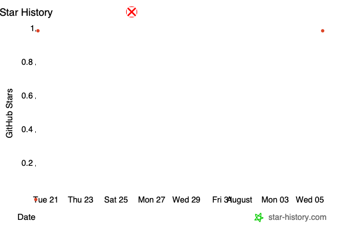

<p align="center">
  <picture>
    <source media="(prefers-color-scheme: dark)" srcset="assets/default-banner.png">
    <source media="(prefers-color-scheme: light)" srcset="assets/default-banner.png">
    
  </picture>
</p>

# 🦐 mu-skill-creator · Skill创作发明家

> The quality gatekeeper for AI agent skills — a 55-item, 10-layer audit model with 38 anti-patterns, baked into an 8-stage gated creation workflow.

**English** | [中文](README_CN.md) | [🌐 Landing Page](https://muippt.github.io/mu-skill-creator/)

[](https://mp.weixin.qq.com/s/YLtXENt_7WzO2DgJCFUtPA)
[](https://xhslink.com/m/ESxtgUNMdl)
[](https://item.m.jd.com/product/14547345.html)
[](https://muippt.github.io/mu-skill-hub/)
[](LICENSE)
[](https://github.com/muippt/mu-skill-creator/releases)
[](https://github.com/muippt/mu-skill-creator/stargazers)

---

### 💡 Usage Examples

| Scenario | What you say | What happens |
|----------|-------------|--------------|
| 🆕 Create a new skill from scratch | "Create a skill that converts Markdown to articles" | Full 8-stage gated workflow: requirements → planning → L1/L2/L3 authoring → audit → handoff |
| 🔍 Audit an existing skill | "Run quality audit on my-skill" | 55-item checklist across 10 layers, with automated shell scan + human-judgment items |
| 🚫 Fix anti-patterns | "Check my skill for anti-patterns" | AP-1 through AP-38 catalog scanned, each flagged with root cause and fix |
| 🎯 Optimize trigger words | "My skill isn't activating — help me fix the trigger" | Trigger word analysis: banned-word scan, coverage test, pushy-principle check |
| 📊 Batch scan multiple skills | `bash scripts/skill-audit.sh skill-a skill-b` | Automated structural health check across all specified skills |
| ✂️ Refactor a bloated skill | "My SKILL.md is 400 lines, help me slim it down" | 3-layer model applied: keep L2 ≤ 300 lines, move reference material to L3 |

---

### ✨ Core Highlights

#### 55-Item, 10-Layer Audit Model

10 audit layers covering document structure, architecture consistency, code quality, cross-file alignment, security compliance, robustness, and content quality. 29 items are auto-scannable via shell script; 26 require human judgment. Every rule traces back to a real incident — no abstract advice.

| Layer | Audit Target | Items | Auto |
|-------|-------------|-------|------|
| L1 | Document Structure | 8 | 5 |
| L2 | Architecture Consistency | 5 | 2 |
| L3 | Code Quality | 8 | 6 |
| L4 | Cross-File Consistency | 5 | 1 |
| L5 | Doc-Code Alignment | 3 | 2 |
| L6 | Dependency Integrity | 3 | 2 |
| L7 | File Hygiene | 6 | 5 |
| L8 | Security & Compliance | 3 | 2 |
| L9 | Robustness & Degradation | 7 | 1 |
| L10 | Content Quality | 6 | 1 |
| **Total** | | **55** | **29** |

#### 3-Layer Architecture (L1 / L2 / L3)

Context-aware loading: L1 trigger words always loaded (~100 words), L2 workflow loaded on activation (SKILL.md ≤ 300 lines), L3 reference docs loaded on demand. Controls context window bloat by design — only what's needed, when it's needed.

#### AP-1 ~ AP-38 Anti-Pattern Catalog

38 anti-patterns, each traced to a real incident, linked to a design principle, and paired with a concrete fix. Battle-tested corrections, not abstract advice. Scanned automatically during every audit cycle.

New in v4.1: AP-35 (incident closure / ICE-5), AP-36 (attachment file overlap), AP-37 (known limitation bloat — three-element structure with P/D/E classification, ≤3 items, three-dimensional importance ranking).

#### Automated Audit Script

`skill-audit.sh` performs batch scanning with a single command. Checks IRON LAW placement, description format, security risks, line count, code quality, broken references, and more — before every handoff.

#### Stall Detection Rules

Built-in quantitative signals (stale_count, time limits, failure thresholds) prevent infinite loops and silent failures in iterative or scheduled skills. When progress stalls, the system switches structure — not just parameters.

#### Security-First Design

Hard rules against credential leakage, personnel data exposure, and restricted system access. Automated scanning catches violations before handoff. `.skillignore` ensures user-state files never enter version control.

---

### 📌 Comparison

| Dimension | mu-skill-creator | Manual Authoring | Generic Prompt Templates | AI Agent Frameworks |
|-----------|-----------------|-----------------|------------------------|---------------------|
| Audit model | 55 items, 10 layers | None | None | Varies |
| Automated scanning | ✅ Shell script | ❌ | ❌ | Rare |
| Anti-pattern catalog | 38 items, traced to incidents | None | None | Few |
| Context-aware loading | ✅ 3-layer (L1/L2/L3) | ❌ Single file | ❌ | Varies |
| Gated workflow | ✅ 8 stages with entry/exit | ❌ | ❌ | Rare |
| Stall detection | ✅ Quantitative signals | ❌ | ❌ | ❌ |
| Security scanning | ✅ Pre-handoff | Manual only | ❌ | Varies |
| Trigger optimization | ✅ 10+10 test, coverage check | ❌ | ❌ | ❌ |
| Known limitation standard | ✅ 3-element + P/D/E + ≤3 items | ❌ | ❌ | ❌ |

---

### 🚀 Workflows

| Workflow | Scenario | Trigger |
|----------|----------|---------|
| Create new skill | Building a skill from scratch | "Create a skill that does X" |
| Audit existing skill | Quality check before handoff | "Audit my-skill for quality" |
| Fix anti-patterns | Diagnosing skill degradation | "Check my skill for anti-patterns" |
| Optimize triggers | Skill not activating reliably | "My skill isn't triggering" |
| Refactor bloated skill | SKILL.md exceeding 300 lines | "Help me slim down my SKILL.md" |
| Batch scan | Multi-skill health check | `bash scripts/skill-audit.sh skill-a skill-b` |
| Handoff | Final security scan + package (publishing is delegated to dedicated tools) | "Hand off my-skill" |

---

### ⚙️ Technical Specs

| Item | Description |
|------|-------------|
| Architecture | 3-layer model (L1 trigger / L2 workflow / L3 reference) |
| Audit model | 55 items across 10 layers (29 auto-scannable, 26 human-judgment) |
| Anti-patterns | 38 items, each linked to a real incident and fix |
| Known limitations | 3-element structure (boundary → trigger → degradation), P/D/E classification, ≤3 items, three-dimensional importance ranking |
| Workflow stages | 8 main + 2 optional (1.5 case study, 6.5 eval testing) |
| Audit script | Bash shell script, zero external dependencies |
| Skill format | Markdown (SKILL.md) + references/ + scripts/ + assets/ |
| Dependencies | None — pure Markdown + Bash |
| Output format | SKILL.md + reference docs + automated audit report |
| Line budget | L2 ≤ 300 lines (official recommendation: 500, tightened to 300) |
| IRON LAW | Business-specific constraints, max 6 rules |
| Version | v4.1.7 |

---

### 🛠️ Quick Start

**1. Clone and install**

```bash
git clone https://github.com/muippt/mu-skill-creator.git
cp -r mu-skill-creator /path/to/your/agent/skills/
```

**2. Create or audit a skill**

Tell your AI agent:

```
"Create a skill that does X"           → full 8-stage creation workflow
"Audit my-skill for quality issues"    → 55-item 10-layer audit
```

**3. Run the automated scanner**

```bash
bash scripts/skill-audit.sh <skill-name>    # scan one skill
bash scripts/skill-audit.sh                  # scan all skills
bash scripts/skill-audit.sh --verbose        # detailed output
```

---

### 🔒 Security & Privacy

- **No credentials in skill files** — Tokens, API keys, and secrets must never appear in SKILL.md, frontmatter, or reference documents.
- **No personal data** — Names, user IDs, organizational info, and sensitive personnel data are prohibited in all skill files.
- **Restricted system blocklist** — Skills cannot call APIs for HR, talent, or other sensitive internal systems.
- **User-state isolation** — Local preferences, snapshots, and recommendation history must be excluded from published skill packages via `.skillignore`.
- **Automated security scanning** — `skill-audit.sh` checks for credential leaks, PII exposure, and restricted system references before every handoff.
- **Local execution** — Everything runs locally. No telemetry, no data collection, no cloud calls.

---

### ⭐ Star History

If this project helped you build better AI agent skills, give it a star ⭐

[](https://www.star-history.com/?repos=muippt%2Fmu-skill-creator&type=date)

> The quality gatekeeper for AI agent skills — 55 items, 10 layers, 38 anti-patterns, zero compromises.

---

### 👤 About the Author

🎓 Signatory Author of Tsinghua University Press / 2026 Dangdang Influential Author / AI & Large Model Business HR Specialist at a Leading Tech Company / National Level-1 HR Manager / Level-2 Psychological Counselor / Self-taught Designer

📚 Author of [*Visual Team Management*](https://item.m.jd.com/product/14547345.html). Clients include ByteDance, Tencent, Baidu, China Mobile, SMG, BOE…

💡 [WeChat Official Account](https://mp.weixin.qq.com/s/YLtXENt_7WzO2DgJCFUtPA) / [Xiaohongshu](https://xhslink.com/m/ESxtgUNMdl): muippt

---

### 📄 License & Acknowledgments

[MIT](LICENSE) © 2026 muippt

This project stands on the shoulders of the AI agent community. We acknowledge the open-source tools, design patterns, and real-world incident lessons that shaped this framework.

> Note: Much of this project was co-created with AI assistance. If you believe your work has been used without proper attribution, please open an issue.

---

> **Version**: v4.1.7 · [Landing Page](https://muippt.github.io/mu-skill-creator/) · [Releases](https://github.com/muippt/mu-skill-creator/releases)
>
> **What's New in v4.1.7**: Rendering fix — removed the blank line that split the AP table (AP-23~38 now render as proper table rows instead of raw pipe text).
